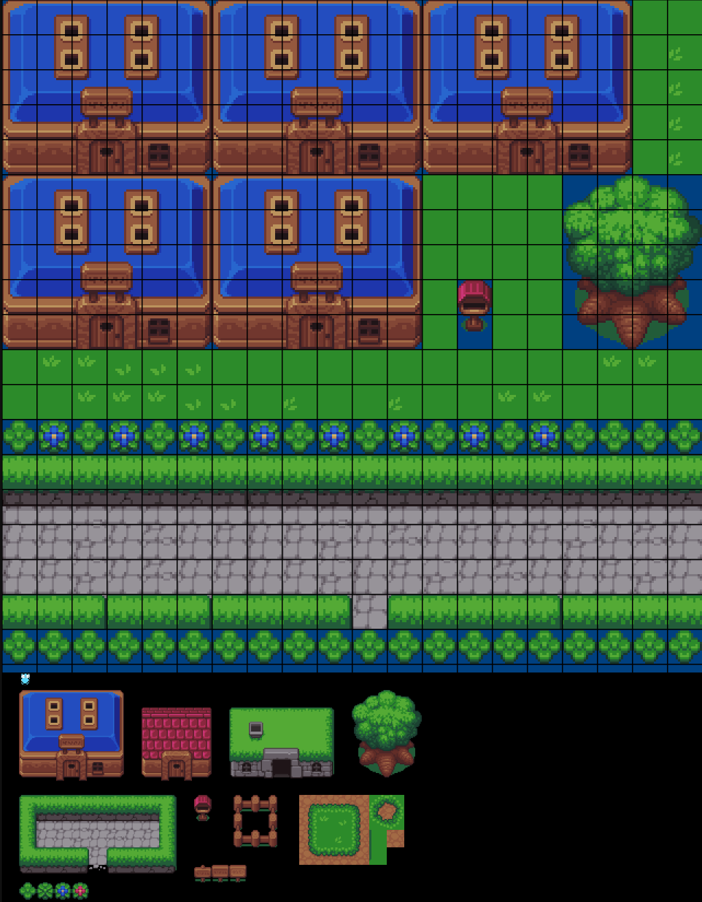

# bananamap
A simple map editor that embeds maps into png files.

* Import your spritesheet as a png.
* Stamp out your map/level
* Select which tiles have collision enabled
* ~~Save your png with the newly created map embedded.~~ (I'm not sure how much data we can save in the png... will revisit this)
* Save mapdata as a json file

## DevLogs
I'm trying to write out some thoughts as I build this.

* [1](https://dustinfirebaugh.com/blog/LetsMakeAMapEditor/)
* [2](https://dustinfirebaugh.com/blog/MakeAMapPt2/)

